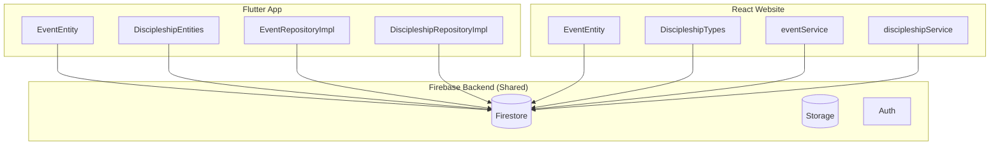
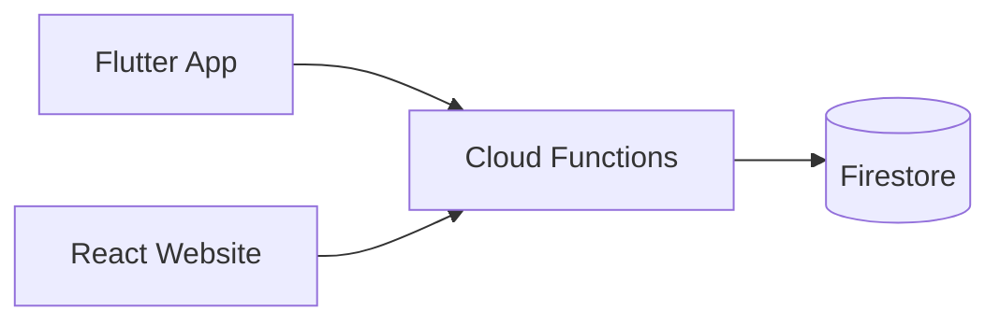

# Architecture Analysis: Shared Code Opportunities

## Executive Summary

Both projects share the **same Firebase backend** and have **significant code duplication** in data models, service layers, and utility functions. This creates real risk of data inconsistency when changes are made to one project but not the other.

---

## Current Architecture



---

## Identified Duplication

### 1. Data Models (High Risk ⚠️)

| Entity | Flutter Location | React Location | Fields Match? |
|--------|------------------|----------------|---------------|
| Event | [event_entity.dart](file:///Users/nl/projects/church_app/lib/domain/entities/event_entity.dart) | [event.types.ts](file:///Users/nl/projects/viet_corner_website/src/types/event.types.ts) | ✅ Yes |
| DiscipleshipCourse | [discipleship_course_entity.dart](file:///Users/nl/projects/church_app/lib/domain/entities/discipleship_course_entity.dart) | [discipleship.types.ts](file:///Users/nl/projects/viet_corner_website/src/types/discipleship.types.ts) | ✅ Yes |
| DiscipleshipLocation | [discipleship_location_entity.dart](file:///Users/nl/projects/church_app/lib/domain/entities/discipleship_location_entity.dart) | [discipleship.types.ts](file:///Users/nl/projects/viet_corner_website/src/types/discipleship.types.ts) | ✅ Yes |
| DiscipleshipClass | [discipleship_class_entity.dart](file:///Users/nl/projects/church_app/lib/domain/entities/discipleship_class_entity.dart) | [discipleship.types.ts](file:///Users/nl/projects/viet_corner_website/src/types/discipleship.types.ts) | ✅ Yes |

**Shared fields across both codebases:**
- `id`, `title`, `subtitle`, `dateDisplay`, `heroImageUrl`, `thumbnailImageUrl`
- `location`, `notes`, `startDateTime`, `endDateTime`, `isActive`, `order`
- Discipleship: `name`, `description`, `courseId`, `locationId`, `startTime`, `endTime`, `contact`, `passage`

### 2. Firebase Services (Medium Risk)

Both projects implement nearly identical CRUD operations:

| Operation | Flutter | React |
|-----------|---------|-------|
| Get all events | `watchActiveEvents()` | `getAllEvents()` |
| Get event by ID | `getEventById()` | `getEventById()` |
| Create event | `createEvent()` | `createEvent()` |
| Update event | `updateEvent()` | `updateEvent()` |
| Delete event | `deleteEvent()` | `deleteEvent()` |

### 3. Utility Functions (Medium Risk)

| Utility | Flutter | React |
|---------|---------|-------|
| Date formatting (VN locale) | Uses `dateDisplay` from Firestore | [dateFormatter.ts](file:///Users/nl/projects/viet_corner_website/src/utils/dateFormatter.ts) |
| Image fallbacks | `ImageHelper.getBestImage()` | Inline logic |
| Firebase constants | `FirebaseConstants` class | Hardcoded strings |

> [!WARNING]
> The React website **generates** `dateDisplay` on create/update, while Flutter **reads** it from Firestore. If someone creates an event via the mobile app without setting `dateDisplay`, it could show blank dates on the website.

---

## Risk Assessment

| Risk | Severity | Example |
|------|----------|---------|
| Field mismatch | **High** | Adding a new field to one codebase but not the other |
| Business logic drift | **High** | Different date formatting between platforms |
| Firestore rules | **Medium** | Security rules only tested against one client |
| Type inconsistency | **Medium** | `recurring` field: optional in Flutter, required in React |

---

## Consolidation Options

### Option A: Shared TypeScript Package (Recommended for React)

Create a shared npm package with:
- Type definitions (generate Dart from TS or vice versa)
- Validation schemas (Zod)
- Firebase collection/field constants

```
packages/
  shared-types/
    src/
      events.ts
      discipleship.ts
      constants.ts
```

**Pros:** Single source of truth for types  
**Cons:** Dart/TypeScript language barrier

### Option B: Firebase Functions as API Layer

Move business logic to Firebase Cloud Functions:
- Both apps call the same endpoints
- Centralized validation and date formatting
- Easier to add push notifications later



**Pros:** True single source of truth, language-agnostic  
**Cons:** Latency, requires more Firebase setup, cost

### Option C: Schema-Driven Development (Best Long-Term)

Define schemas in a neutral format (JSON Schema, Protocol Buffers):
- Generate TypeScript types
- Generate Dart classes  
- Generate Firestore security rules

**Pros:** Full consistency, automated sync  
**Cons:** Upfront tooling investment

### Option D: Shared Constants File (Quick Win)

At minimum, share collection names and field names:

```typescript
// shared-constants.json
{
  "collections": {
    "events": "events",
    "discipleshipCourses": "discipleship_courses",
    "discipleshipLocations": "discipleship_locations", 
    "discipleshipClasses": "discipleship_classes"
  },
  "fields": {
    "isActive": "isActive",
    "dateDisplay": "dateDisplay",
    "order": "order"
  }
}
```

Both projects import this file to prevent typos.

---

## Recommended Action Plan

1. **Immediate (Week 1):** Create shared constants file for collection/field names
2. **Short-term (Month 1):** Move `dateDisplay` generation to a Cloud Function trigger on Firestore writes
3. **Medium-term:** Evaluate schema-first approach if adding more features (prayer requests, push notifications)

---

## Push Notifications Architecture Note

For your planned push notification feature, you'll want:
- Firebase Cloud Messaging (FCM) for the mobile app
- Web Push API for the website
- A Cloud Function to trigger notifications (shared logic)

This reinforces the value of Option B — centralizing logic in Cloud Functions now will make notifications easier later.
